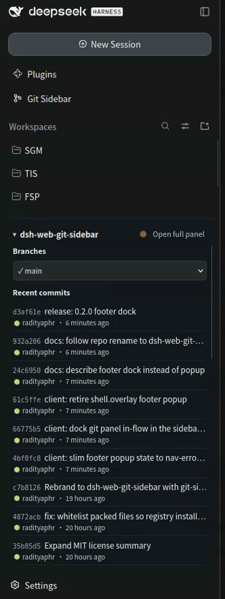
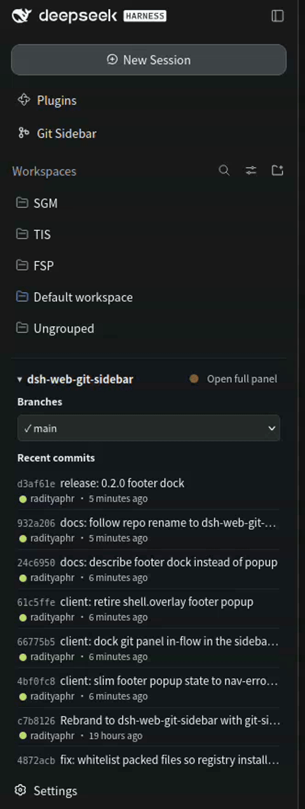

<div align="center">

# 🌿 DSH Web Git Sidebar

### Git, where your eyes already are.

**A VS Code-style Source Control panel for DeepSeek Harness, living in the left rail.**
Branches, graph, previews, and push-state — one click from the left rail. No telemetry. No cloud. Just git.

[](LICENSE)
[](https://github.com/RaditPasya/dsh-web-git-sidebar)
[](https://github.com/RaditPasya/dsh-web-git-sidebar)

[Features](#what-you-get) · [Install](#install) · [Tour](#tour) · [Dev](#dev-loop)

</div>

---

<!-- TODO: replace with a real screenshot of the full panel (1280px wide PNG) -->


## What you get

| | |
|---|---|
| **Branch switcher** | Search, switch, create. `↑N ↓M` ahead/behind, `✓` in sync, `●` local-only. |
| **Commit graph** | Topo-order lanes in living color. Click any row to expand it. |
| **Commit preview** | Files (`A/M/D`), `+ins −del`, message body, author, timestamp. Hover any row for the gist. |
| **Who's who** | Every author gets their own dot color — scan a hundred commits at a glance. |
| **Footer dock** | An always-on branch dropdown + recent commits docked above Settings. *Follows your open session*, hides on non-git workspaces. Click the header to collapse, drag the top edge to resize — it remembers. |
| ⚡ **Fast** | Status + branches + graph in **one** batched host call, cached, skeleton placeholders — no empty flashes. |

<!-- TODO: replace with a real screenshot of the footer dock (400px wide PNG) -->


## Install

```sh
dsh plugin --profile web add dsh-web-git-sidebar
```

Restart the web UI once (new host routes), refresh — the **Git icon** appears in the left rail.

> Local hacking? Clone and link it instead:
> ```sh
> git clone https://github.com/RaditPasya/dsh-web-git-sidebar.git
> dsh plugin --profile web add link:$(pwd)/dsh-web-git-sidebar
> ```

## Dev loop

```sh
pnpm install
node scripts/build.mjs   # lib/index.js (host) + lib/client.js (browser)
```

`link:` installs pick up rebuilds live — just refresh the page. No test suite yet;
`tsc --noEmit` is the gate (`pnpm run typecheck`).

```
src/
├── core/        git vocabulary: commands, parsers, wire types
├── host/        workspace-gated service + /git-sidebar/* routes + SSE
└── client/
    ├── api.ts       typed fetch client
    └── sidebar/     icon · panel · footer dock · shared kit
```

<table>
  <tr>
    <td></td>
    <td></td>
  </tr>
</table>

## License

MIT — the industry-standard permissive license. You are free to use this
software commercially, modify it, distribute it, sublicense it, and sell
copies of it. The only requirements: keep the copyright notice and this
permission notice in all copies. The software is provided "as is", without
warranty of any kind, and the authors are not liable for any claims or
damages. See [LICENSE](LICENSE) for the full text.
